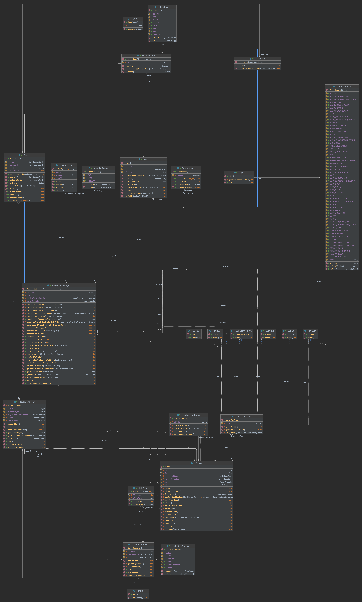

# Jinx Dokumentation
- [Table of Contents](#table-of-contents)
- [Codebase](#codebase)
    * [UML-Diagramm](#uml-diagramm)
    * [Klassen](#klassen)
        + [Main](#main)
        + [Card](#card)
        + [NumberCard](#numbercard)
        + [LuckyCard](#luckycard)
        + [NumberCardStack](#numbercardstack)
        + [LuckyCardStack](#luckycardstack)
        + [CardHand](#cardhand)
        + [LuckyCardHand](#luckycardhand)
        + [NumberCardHand](#numbercardhand)
        + [Dice](#dice)
        + [Field](#field)
        + [GameController](#gamecontroller)
        + [Game](#game)
        + [PlayerManager](#playermanager)
        + [Player](#player)
        + [AutonomousPlayer](#autonomousplayer)
        + [SafeScanner](#safescanner)
        + [AES](#aes)
        + [ResourceManager](#resourcemanager)
        + [GameState](#gamestate)
        + [DatabaseConstants](#databaseconstants)
        + [JDBCHelper](#jdbchelper)
        + [HighScoreList](#highscorelist)
        + [DatabaseHistoryManager](#databasehistorymanager)
        + [FileHistoryManager](#filehistorymanager)
        + [LogFileHandler](#logfilehandler)
        + [LogFileFormatter](#logfileformatter)
        + [PlayMoveFileFormatter](#playmovefileformatter)
        + [DatabaseLoginManager](#databaseloginmanager)
        + [FileLoginManager](#fileloginmanager)
        + [Presenter](#presenter)
        + [Views](#views)
        + [RoundedBorder](#roundedborder)
        + [SwingColors](#swingcolors)
    * [Interfaces](#interfaces)
        + [IPlayerManager](#iplayermanager)
        + [IHistoryNanager](#ihistorymanager)
        + [ILoginManager](#iloginmanager)
        + [IModel](#imodel)
    * [Records](#records)
        + [Weight](#weight)
        + [HighScore](#highscore)
        + [PlayerHistory](#playerhistory)
    * [Enums](#enums)
        + [LuckyCardNames](#luckycardnames)
        + [CardColor](#cardcolor)
        + [ConsoleColor](#consolecolor)
        + [AgentDifficulty](#agentdifficulty)
- [Features](#features)
- [Roadmap](#roadmap)
- [Changelog](#changelog)
    * [Abgabe 1](#abgabe-1)
        + [Added](#added)
    * [Abgabe 2](#abgabe-2)
        + [Added](#added-1)
        + [Changed](#changed)
    * [Abgabe 3](#abgabe-3)
        + [Added](#added-2)
        + [Changed](#changed-1)
    * [Abgabe 4](#abgabe-4)
        + [Added](#added-3)
        + [Changed](#changed-2)
# Codebase

## UML-Diagramm



## Klassen

### Main

Die Main Klasse ist die simpelste von alle Klassen da, diese nur über die main Methode verfügt die das Program ausführt und ein Objekt von [GameContoller](#gamecontroller) initalisiert um das Spiel zu starten

### Card

Card ist eine abstrakte Klasse die eine Karte darstellen soll. Von Card erben [NumberCard](#numbercard) und [LuckyCard](#luckycard)

### NumberCard

NumberCard erbt von Card und dient als Abbild der nummerierten Karten im Spiel Jinx. Jede NumberCard verfügt über eine Farbe die über [CardColor](#cardcolor) definiert ist und eine Nummer von 1 bis 6.

### LuckyCard

LuckyCard erbt von [Card](#card) ist aber auch eine abstrakte Klasse die grob die verschiedenen Glückskarten im Spiel Jinx abbilden soll. LuckyCard hat zudem noch eine effect Methode die von den jewieiligen Subklassen überschrieben werden.

- LC123
    - Wenn der Spieler diese Karte nutzt kann er sich eine Zahl von 1-3 als sein Wurfergebnis wählen. Diese Karte kann auch nach den würfeln noch genutzt werden
    - Karte kann nur ein mal genutzt werden und muss danach aus dem Deck entfernt werden
- LC456
    - Wenn der Spieler diese Karte nutzt kann er sich eine Zahl von 4-6 als sein Wurfergebnis wählen. Diese Karte kann auch nach den würfeln noch genutzt werden
    - Karte kann nur ein mal genutzt werden und muss danach aus dem Deck entfernt werden
- LCPlus1
    - Wenn der Spieler diese Karte nutzt kann er sein Würfelergebnis um + 1 erhöhen, jedoch nicht wenn er eine 6 gewürfelt hat
    - Die Karte muss nie abgelegt werden
- LCMinus1
    - Wenn der Spieler diese Karte nutzt kann er sein Würfelergebnis um - 1 verringern, jedoch nicht wenn er eine 1 gewürfelt hat
    - Die Karte muss nie abgelegt werden
- LCSum
    - Lässt den Spieler mehrere Karten aus dem Feld entnehmen die in Summe der gewürfelten Zahl entsprechen. Falls der Spieler 2 Karten dieser Art in der Hand hat kann er das Würfelergebnis um + 1 erhöhen
    - Die Karte muss nie abgelegt werden
- LCPlusDiceThrow
    - Lässt den Spieler nocheinmal Würfeln
    - Die Karte muss nie abgelegt werden

### NumberCardStack

Die Klasse NumberCardStack dient zur abbildung eines Kartendecks. NumberCardStack erbt von der generischen Stack Datenstruktur und generiert bei Konstruktor auffruf ein Deck mit allen [NumberCards](#numbercard) die man zum spielen von Jinx braucht. Ist im Projekt Ordner zudem eine NumberCards.csv Datei vorhanden so wird das Deck, sowie die Reihenfolge der Karten aus der .csv Datei übernommen.

### LuckyCardStack

LuckyCardStack dient zur abbildung eines Kartendecks für Glückskarten. LuckyCardStack erbt von der generischen Stack Datenstruktur und generiert bei Konstruktor auffruf ein Deck mit allen [LuckyCards](#luckycard) die man zum spielen von Jinx braucht. Ist im Projekt Ordner zudem eine LuckyCards.csv Datei vorhanden so wird das Deck, sowie die Reihenfolge der Karten aus der .csv Datei übernommen.

### Dice

Die Dice Klasse simuliert einen 6 seitigen Würfel der mit der Methode use() eine zufällige Zahl von 1-6 zurückgibt

### Field

Die Field Klasse spiegelt das 4x4 Kartenfeld des Spieles Jinx da. Field ist als Singleton Pattern realisiert um immer nur eine Instanz des Fields im Spiel zu haben.

### GameController

Der GameController steuert das Spiel und managt die Runden, sowie auch die [Highscores](#highscore) der Spieler.

### Game

Game ist das Herz unseres Spiels hier werden die unterschiedlichen Phasen des Spiels abgebildet.

### PlayerManager

Der PlayerController registriert, speichert und verwaltet die Spieler im Spiel. Er kontrolliert auch welcher Spieler gerade am Zug ist

Der PlayerController ist als Singleton Pattern realisiert um in verschiedenen Klassen die gleiche Instanz zu haben.

### Player

Player dient als Datenstruktur für die unterschiedlichen Spieler im Spiel

### AutonomousPlayer

Der AutonomousPlayer ist eine Klasse die von [Player](#player) erbt und einen künstlich Intelligenten Spieler simuliert. Er verfügt über eine Schwierigkeitsstufe die zum anfang des Spiels gewählt werden kann und durch [AgentDifficulty](#agentdifficulty) definiert wird.

Der AP (Autonomous Player) kann gegen menschliche und andere künstliche Spieler spielen und entscheidet anhand von der gewichtung der Karten auf dem Feld und dem Würfelergebnis Welche Karte er zieht. Je nach Schwierigkeitsstufe berechnet er Sachen mal anders.

Kriterien zur gewichtung einer Karten:

- Zahl der Karte ist größer oder gleich der durchschnittlichen Kartenzahl auf dem Feld = +1 Gewicht
- Zahl der Karte ist kleiner als die durchschnittliche Kartenzahl auf dem Feld = -1 Gewicht
- Farbe der Karte kommt in unserer Hand vor = +1 Gewicht
- Farbe der Karte kommt nicht in unserer Hand vor = -1 Gewicht
- Farbe der Karte kommt oft (≥ 33%) in unserer Hand vor = +1 Gewicht
- Farbe der Karte kommt nicht oft (< 33%) in unserer Hand vor = -1 Gewicht
- Farbe der Karte ist in Gegnerhand = -1 Gewicht
- Farbe der Karte ist nicht in Gengerhand = +1 Gewicht
- Farbe der Karte kommt wenig (< 33%) in Gegnerhand vor = +1 Gewicht
- Karten Farbe kommt wenig auf dem Feld vor = +1 Gewicht
- Karten Farbe kommt oft auf dem Feld vor = -1 Gewicht
    - Die häufigkeit einer Karte wird durch die Formel

      $\lfloor| (\frac{Karten \; im \; Feld}{4}) - (Spieleranzahl - 2) |\rfloor$ bestimmt


Damit der AP die Karten gewichten kann muss er jedoch erst immer den gefährlichsten Gegner aus machen, da der AP in jeden Zug nur gegen den gefärlichsten Spieler spielt und nicht gegen alle Spieler

Kriterien zur Gewichtung des gefährlichsten Spielers

- Der Gegner hat mehr Karten auf der Hand als der durchschnittliche Spieler = +1 Gewicht
- Der Gegner hat weniger Karten auf der Hand als der durchschnittliche Spieler = -1 Gewicht
- Der Gegner mehr als 3 verschiedene Karten auf der Hand hat = +1 Gewicht
- Ger Gegner wniger als 3 verschiedene Karten auf der Hand hat = -1 Gewicht
- Der Gegner hat mehr Punkte als der Durchschnitt = +1 Gewicht
- Der Gegner hat weniger Punkte als der Durchschnitt = -1 Gewicht

### SafeScanner

SafeScanner ist ein Wrapper um den java.util.Scanner. Er stellt spezielle Methoden zur verfügung die Fehler abfangen und nur bestimmte Eingaben zulassen

### CardHand

CardHand dient als Struktur fuer die Numbercards und Luckycards, die der Spieler hat

### LuckyCardHand

Besteht aus den Luckycards, die der jeweilige Spieler hat

### NumberCardHand

Besteht aus den Numbercards, die der jeweilige Spieler hat

### AES

Ist fuer die Verschluesselung der Passwoerter zustaendig

### Login

Ist fuer den Login ueber die Textdatei zustaendig

### ResourceManager

Mit dem Resourcemanager kann man relevante Spieldaten in eine .save-Datei schreiben und auch laden

### Gamestate

Datenstruktur für das Speichern des aktuellen Spielstands

### DatabaseConstants

Alle relevanten Konstanten für eine Datenbankverbindung werden hier aufgelistet

### JDBCHelper

Stellt eine Verbindung zur Datenbank her und kann sie auch schließen
Zudem schließt es auch die Statements und ResultSets

### HighScoreList

Lädt die Highscores aus einer .txt Datei und kann auch in diese .txt Datei schreiben
Dazu kann es die Highscore-Liste auch auf der Konsole ausgeben

### DatabaseHistoryManager

Speichert die Spielhistorien der Spieler in der Datenbank und kann sie dort auch wieder
aus der Datenbank laden

### FileHistoryManager

Speichert die Spielhistorien der Spieler in einer .txt Datei und kann sie dort auch wieder
aus der .txt Datei laden

### LogFileHandler

Initiiert den FileHandler eines Loggers, damit der Logger in eine .txt Datei schreibt

### LogFileFormatter

Formatiert die Ausgabe der Logger in einer .txt Datei

### PlayMoveFileFormatter

Formatiert die Ausgabe der Logger auf der Konsole

### DatabaseLoginManager

Kümmert sich um das Einloggen in der Datenbank
Prüft zuvor ob der User mit dem Passwort in der Datenbank existiert und gibt "true" zurück, wenn
dies der Fall ist.
Ist auch für das Registrieren in der Datenbank zuständig.
Prüft erst, ob der Name in der Datenbank existiert.

### FileLoginManager

Kümmert sich um das Einloggen in einer .txt Datei
Prüft zuvor ob der User mit dem Passwort in der txt Datei existiert und gibt "true" zurück, wenn
dies der Fall ist.
Ist auch für das Registrieren in der .txt Datei zuständig.
Prüft erst, ob der Name in der .txt Datei existiert.

### Presenter

Die Presenter kümmern sich um die Logik und updaten die Views
Jeder Presenter bekommt eine View und ein Model als Paramater
- DicePresenter
   - hat Dice als Model
- FieldPresenter
   - hat Dice als Model
- GamehistoryPresenter
   - hat HistoryManager als Model
- HighscorePresenter
   - hat HighScoreList als Model
- LoginPresenter
   - hat PlayerManager als Model
- PlayerHandPresenter
- PlayerManagerPresenter
- RegisterPresenter
   - hat Gamestate als Model
- StartPresenter
   - hat GameState als Model

### Views

Oberklasse für alle Views der GUI. Views sind die Fenster, die angezeigt werden
- DiceView
   - Zeigt den Würfel auf der GUI an
- FieldView
   - Zeigt das Kartenfeld auf der GUI an
- GamehistoryView
   - Zeigt die Spielhistorie des jeweiligen Spielers an
- GameView
   - Container View für Würfel, Feld, Spieler und Spielerhände
- HighscoreView
   - Zeigt die Highscores aller Spieler
- LoginView
   - Login Fenster der GUI
- MainView
   - Container für alle Views als CardLayout
- NumberCardView
   - View für die einzelnen Karten
- PlayerHandView
   - Zeigt das Feld für die Spielerhand
- PlayerManagerView
   - Zeigt alle eingeloggten Spieler
- RegisterView
   - Fenster für die Registrierung der Spieler
- StartView
   - Hauptmenü in dem man die Speichermethode auswählen kann

### RoundedBorder

Durch das Nutzen dieser Klasse werden die Ecken von Textfeldern in der GUI gerundet

### SwingColors

In dieser Klassen werden verschiedene Farben für die Gui in Variablen gespeichert

## Interfaces

### IPlayerManager

PlayerManager implementiert IPlayerManager
Hier sind die Methoden für die Queue und ob der Spieler schon existiert deklariert

### IHistoryManager

DatabaseHistoryManager und FileHistoryManager implementieren IHistoryManager
Hier sind die Methoden für das Speichern und Lesen der Spielhistorie deklariert.

### ILoginManager

DatabaseLoginManager und FileLoginManager implementieren ILoginManager
Hier sind die Methoden für das Checken der User-Daten, das Registrieren eines neuen Users,
die Ausgabe des Logins und die Ausgabe der Registrierung deklariert

### IModel

Alle Model des MVP-Patterns implementieren IModel

---

## Records

### Weight

Generisches Record zum gewichten von Objekten wie Spieler oder Karten. Weight hat zwei Attribute object und weight, object ist ein generischer Typ und speichert die Referenz auf das zu gewichtene Objekt. Das weight Attribute ist vom Typ int und speichert das jeweillige Gewicht.

### HighScore

Das HighScore Record, dient dazu Highscores zu speichern die aus der Highscore.txt Datei ausgelesen zu werden und während Programm lauf zu verfügung zu stellen.

---

## Enums

### LuckyCardNames

Datentyp für die Konstanten der Namen aller [LuckyCards](#luckycard).

### CardColor

Datentyp für die Konstanten der Farben für die [NumberCard](#numbercard) Klasse.

### ConsoleColor

Ein Enum das eine Reihe an Unicode Konstanten hergibt zum ändern der Schriftfarbe und Hintergrundfarbe im Terminal.

### AgentDifficulty

Datentyp für die Schwierigkeitsstufen der Spieler KI

- EASY
- MEDIUM
- HARD

# Features

- Spiele mit 2-4 Spielern gleichzeitig
- KI Spieler in 3 Schwierigkeitsstufen (Easy, Medium, Hard)
- HighScores
- Undo Funktion falls man einmal zu viel gewürfelt hat
- Farbiger Output
- Prüfung der Csv Dateien (NumberCards.csv und LuckyCards.csv)
- 100% JavaDoc
- Spiel wird gespeichert
- Datenbank und .txt support
- Match-history gespeichert
- Spielzuege gespeichert
- Replay des letzten Spiels
- Nochmal spielen
- Gui

# Roadmap

- [x]  Gui Startscreen
- [x]  Gui Login und Registrierung
- [x]  Gui Highscores
- [x]  Gui Playermanager
- [x]  Gui Spielhistorie
- [x]  Gui Kartenfeld
- [x]  Gui Würfel
- [ ]  Gui Spielelogik


# Changelog

Alle nennenswerten Änderungen an diesem Projekt werden hier dokumentiert.

## Abgabe 1

25.10.2022

### Added

- Grundstruktur des Spiels

---

## Abgabe 2

15.11.2022

### Added

- [SafeScanner](#safescanner) ist eine Wrapper Klasse für die java.utils.Scanner Klasse
- Undo Funktion lässt Spieler jetzt vorherige Würfelergebnisse zurückholen
- Farbige Kartenausgabe
- LCSum implementiert
- Neustart des Spiels nach Ende eines Spiels
- Gewinner wird nun angezeigt

### Changed

- LuckyCardNames Enum
    - Das Enum [LuckyCardNames](#luckycardnames) hält die Namen jeder LuckyCard, so sollen spätere Bugs im Code abgefangen werden, die durch simple Rechtsschreibfehler passieren können
        - Beispiel

            ```java
            // Bad
            if(luckycard.name.equals("LcSum")) // Richtiger name = LCSum
            
            // Good
            if(luckycard.name.equals(LuckyCardNames.LCSum.name()))
            ```

- Jede LuckyCards Klasse weiß jetzt ihren eigenen Namen

    ```java
    // Vorher
    // Konnte schnell Bugs verursachen da man sich schnell verschreiben konnte
    LuckyCard lc = new LCSum("LCSum"); 
    
    // Nachher
    LuckyCard lc = new LCSum()
    ```
## Abgabe 3

### Added

- Spiel speichern
- Replay 
- DB und txt reg und login
- DB und txt spielverlauf


## Abgabe 4

### Added
Gui User-Funktionen wie z.B. einloggen, registrieren usw.

### Changed
Refactoring von Großteil des Codes
